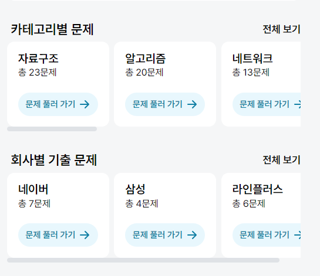
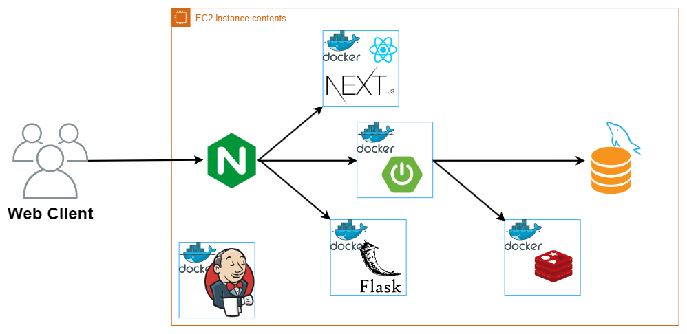

<div align='center'>

</div>
<br>


# 🔎 서비스 소개
#### `OMR(오늘의 문제를 알려줘)`은 개발자를 목표로 하는 취준생이 면접과 CS 지식을 학습하는데 도움을 주는 플랫폼 입니다.
#### 면접과 CS 자료를 찾기 위해 일일이 검색을 하는 당신! 귀찮지 않으신가요?
#### 운영체제, 네트워크, 데이터베이스 뿐만 아니라 기업별 기출 문제와 함께 약 180개의 다양한 카테고리의 문제가 준비되어 있습니다. 데일리 문제 추천과 스트릭 기능을 통해 동기부여를 얻어보세요.
#### 문제 정답을 모르시겠다고요?? AI 답변과 유저들의 답변을 통해 내 정답과 비교해보세요!

<br><br><br>

# 🔧 기술스택

### FE 스택 & 버전
```
react                   18
next                    13.5.6
typescript              5
node                    18.18.0
Storybook               7.5.1
SWR                     2.2.4
Recoil                  0.7.7
Recoil-persist          5.1.0
axios                   1.5.1
Sass                    1.69.4
```

### BE 스택 & 버전
```
Java                    17.0.8
Spring Boot             3.1.5
Spring data Jpa         3.1.5
Querydsl                5.0.0
AWS                     Ubuntu 20.04
Docker                  24.0.6
Redis                   7.x.x
MySQL                   8.0.33
gradle                  8.3
Jenkins                 2.428
Flask                   3.0.0
Python                  3.8.7
Swagger                 5.2.0
Nginx                   1.18.0
```


<br><br>

# 핵심 기능

### 카테고리 및 기업별 문제
약 180개의 문제가 제공됩니다.



### 문제 풀기
정답을 입력하고 다른 사용자의 답변과 비교해보세요
 


### 오늘의 문제 추천
하루에 한 번 사용자에게 랜덤 문제를 추천해줍니다.
 


### 스트릭(잔디) 기능
문제를 풀면 스트릭이 채워집니다. 꾸준히 문제를 풀어 연속 스트릭을 달성해보세요


### AI 문제 답변
문제의 정답을 모르겠다면, AI 문제 답변 기능을 통해 문제의 정답을 확인할 수 있습니다.


 
 <br><br>
# 📏 프로젝트 아키텍처

## 시스템 아키텍처


## ERD 설계


<br>

# 😃 팀원들
|                                         Backend                                          |                                          Backend                                          |                                          Backend                                          |                                         Backend                                         |                                        Frontend                                         |                                         Backend                                         |
| :--------------------------------------------------------------------------------------: | :---------------------------------------------------------------------------------------: | :---------------------------------------------------------------------------------------: | :-------------------------------------------------------------------------------------: | :-------------------------------------------------------------------------------------: | :--------------------------------------------------------------------------------------: | 
|  |  |  |  |  |  |
|                      [김한성](https://github.com/khs960616)                      |                         [백승윤](https://github.com/inputTitleHere)                          |                         [신현철](https://github.com/moonn6pence)                          |                          [김태용](https://github.com/YongsHub)                          |                          [좌정현](https://github.com/imhynni)                           |                        [이용준](https://github.com/jjuny0310)                        |


<br><br>
# 우리가 일하는 방식
## 프로젝트
### ✔️ 무엇이든 기록 잘 하기, 공유 잘 하기
### ✔️ 코딩 컨벤션 지키기
### ✔️ 목표설정 잘 하고 잘 지키기

## 생활수칙
### ✔️ 아침에 활기찬 인사로 시작하기
### ✔️ 부정적인 얘기 들릴 때 긍정적인 말로 중화시켜주기
### ✔️ 일정 있으면 최소 이틀 전에는 공유해주기
### ✔️ 말 예쁘게 하기

### 마인드셋
### ✔️ 포기하지 않는다는 마인드로 프로젝트 끝까지 완성하기
### ✔️ 틀린 의견은 없다! 서로 의견 존중하고 의견 잘 내기
### ✔️ 팀원들 일도 내 일처럼 열심히 참여하기
